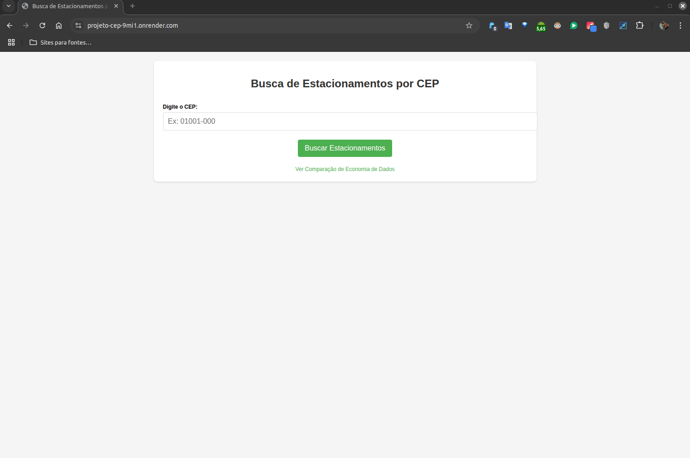

# Instruções para Executar a Aplicação de Busca de Estacionamentos por CEP


## Identificação do Projeto

- **Instituição:** Universidade Cruzeiro do Sul (UNICSUL)
- **Curso:** Superior em Desenvolvimento Back-end
- **Disciplina:** Projeto Integrador Transdisciplinar em Desenvolvimento Back-End I
- **Aluno:** Cleyton Alves da Silva
- **RGM:** 38309696
- **Período letivo:** 2025.1
- **Situação-problema:** 3 - Aplicação de geoposicionamento por CEP

Esta aplicação é uma demonstração do projeto de intervenção para a situação-problema 3, onde desenvolvemos uma API intermediária que consome a API ViaCEP, filtra apenas os dados essenciais e simula a localização de estacionamentos próximos.

## Versão Online de Demonstração

Uma versão funcional desta aplicação está disponível online:

**URL:** [https://projeto-cep-9mi1.onrender.com](https://projeto-cep-9mi1.onrender.com)



> **Nota:** Por estar hospedada em um plano gratuito do Render, a aplicação pode levar até 30 segundos para carregar no primeiro acesso, pois o serviço "adormece" após períodos de inatividade.

Você pode testar a aplicação com CEPs brasileiros válidos como 01001000 (Praça da Sé, São Paulo) ou 20031170 (Centro, Rio de Janeiro).

## Estrutura do Projeto

O projeto consiste em:

1. `app.py` - O arquivo principal com a aplicação Flask
2. `requirements.txt` - Arquivo com as dependências do projeto
3. `templates/` - Diretório com os templates HTML:
   - `index.html` - Página inicial com formulário para consulta de CEP
   - `comparacao.html` - Página que demonstra a economia de dados
4. `assets/` - Diretório com recursos gráficos:
   - `topo.png` - Imagem de cabeçalho do projeto

## Requisitos

- Python 3.6 ou superior
- Flask (`pip install flask`)
- Requests (`pip install requests`)

## Como Executar

### Opção 1: Acessar a Versão Online

A maneira mais simples de testar a aplicação é acessar a versão online:

```
https://projeto-cep-9mi1.onrender.com
```

Note que o primeiro acesso pode demorar até 30 segundos para carregar, pois o serviço está hospedado em um plano gratuito do Render que "adormece" após períodos de inatividade.

### Opção 2: Clonar o repositório GitHub

Se você preferir executar localmente, clone o repositório:

```
git clone https://github.com/cleyton1986/Projeto-cep.git
cd Projeto-cep
pip install -r requirements.txt
python app.py
```

Acesse a aplicação em seu navegador: `http://127.0.0.1:5000/`

### Opção 2: Configurar manualmente

Alternativamente, você pode configurar o projeto manualmente:

1. Crie a estrutura de diretórios:

   ```
   projeto-cep/
   ├── app.py
   ├── requirements.txt
   ├── assets/
   │   └── topo.png
   └── templates/
       ├── index.html
       └── comparacao.html
   ```

2. Copie o código do arquivo `app.py`, `requirements.txt` e dos templates para os respectivos arquivos.

3. Instale as dependências:

   ```
   pip install -r requirements.txt
   ```

4. Execute a aplicação:

   ```
   python app.py
   ```

5. Acesse a aplicação em seu navegador:
   ```
   http://127.0.0.1:5000/
   ```

## Funcionalidades Implementadas

1. **Consulta de CEP Otimizada**:

   - Consome a API ViaCEP
   - Filtra apenas os dados essenciais (logradouro, bairro, cidade e UF)
   - Reduz o tamanho da resposta em aproximadamente 55%

2. **Sistema de Cache**:

   - Armazena consultas recentes em memória
   - Expira o cache após 1 hora
   - Evita consultas repetidas à API externa

3. **Simulação de Estacionamentos**:

   - Gera aleatoriamente estacionamentos próximos
   - Inclui informações como distância, vagas disponíveis e preço/hora

4. **Demonstração de Economia de Dados**:
   - Página de comparação mostrando o JSON original e o otimizado
   - Exibe estatísticas sobre a redução no tamanho dos dados

## Possíveis Melhorias para um Sistema Real

1. Integração com uma API de geolocalização real (como Google Maps Places)
2. Implementação de um sistema de cache persistente (Redis, Memcached)
3. Adição de filtros para os estacionamentos (preço, distância, etc.)
4. Autenticação para proteger a API
5. Monitoramento e limite de requisições (rate limiting)

## Implantação em Produção

Para implantar esta aplicação em um ambiente de produção, consulte os seguintes guias:

- [Instruções para Implantação no Render](./instruções-render.md) - Para implantar o projeto no serviço de hospedagem Render
- [Documentação do Flask sobre implantação em produção](https://flask.palletsprojects.com/en/2.3.x/deploying/) - Para outras opções de implantação

## Relação com o Projeto de Intervenção

Esta aplicação demonstra os conceitos apresentados no projeto de intervenção para a situação-problema 3:

- Consumo de API externa (ViaCEP)
- Filtragem de dados para otimização
- Implementação de cache para melhorar performance
- Intermediação entre o aplicativo cliente e as APIs externas

A aplicação serve como prova de conceito da solução proposta, mostrando como uma camada intermediária pode significativamente reduzir o consumo de dados e melhorar a experiência do usuário.

## Contextualização Acadêmica

Este projeto foi desenvolvido como parte da disciplina "Projeto Integrador Transdisciplinar em Desenvolvimento Back-End I" da Universidade Cruzeiro do Sul, que tem como objetivo integrar conhecimentos sobre APIs, serviços web e desenvolvimento back-end.

A situação-problema 3, conforme apresentada no material didático, descreve um cenário onde estudantes estão desenvolvendo uma aplicação baseada em geoposicionamento que necessita otimizar o uso de dados ao fornecer informações sobre estacionamentos próximos a partir de um CEP.

### Objetivos de Aprendizagem

Este projeto demonstra as seguintes competências e habilidades trabalhadas na disciplina:

1. **Compreensão e aplicação de APIs RESTful** - Uso da API ViaCEP e criação de endpoints próprios
2. **Manipulação de dados em formato JSON** - Processamento, filtragem e transformação de respostas da API
3. **Criação de camadas de serviço otimizadas** - Desenvolvimento de uma API intermediária que melhora a eficiência
4. **Implementação de soluções para problemas reais** - Abordagem prática para otimização de consumo de dados
5. **Uso de tecnologias atuais do mercado** - Python, Flask, APIs RESTful, cache de dados

A solução proposta reflete o contexto da disciplina, integrando conceitos teóricos apresentados no material didático com uma abordagem prática para resolução de problemas de desenvolvimento back-end.
